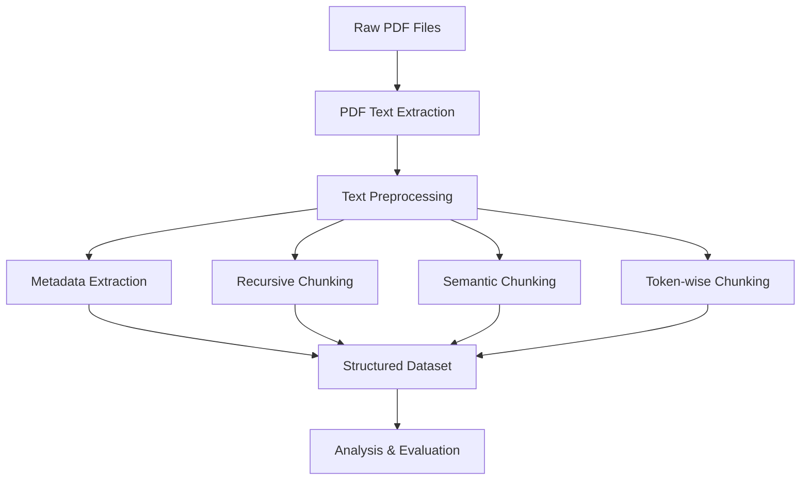

# Indian Supreme Court Judgements - Chunked Dataset & Analysis Toolkit

[](https://choosealicense.com/licenses/mit/)
[](https://www.python.org/downloads/)
[](https://huggingface.co)

> **A comprehensive dataset and analysis toolkit for Indian Supreme Court judgements with multiple chunking strategies, optimized for Legal Language Models (LLMs) and Retrieval Augmented Generation (RAG) systems.**

## 🎯 Table of Contents

- [Overview](#overview)
- [Key Features](#key-features)
- [Dataset Structure](#dataset-structure)
- [Installation & Setup](#installation--setup)
- [Quick Start Guide](#quick-start-guide)
- [Technical Implementation](#technical-implementation)
- [Usage Examples](#usage-examples)
- [Analysis Toolkit](#analysis-toolkit)
- [Evaluation Metrics](#evaluation-metrics)
- [Research & Analysis](#research--analysis)
- [Contributing](#contributing)
- [Ethics & Legal](#ethics--legal)
- [License](#license)

## 🔍 Overview

### Problem Statement

The Indian judiciary faces a massive backlog crisis with over 4.7 crore pending cases. Traditional legal research relies on outdated keyword-based search systems that fail to capture semantic relationships in legal documents. This project addresses the critical need for AI-ready legal datasets to enable advanced retrieval systems.

**Key Statistics:**
- Average case resolution time in High Courts: **5.3 years**
- Some Supreme Court cases pending since: **1982**
- Traditional search accuracy: **Limited by keyword matching**
- Our solution: **Semantic understanding + Multiple chunking strategies**

### Solution Overview

This project provides:

1. **Pre-processed Legal Documents**: 100 Supreme Court judgements converted from PDF to structured text
2. **Multiple Chunking Strategies**: Recursive, Semantic, and Token-based approaches
3. **Analysis Toolkit**: Comprehensive Jupyter notebook for document analysis and summarization
4. **Evaluation Framework**: ROUGE and BLEU metrics for comparing chunking strategies
5. **RAG-Ready Format**: Optimized for embedding and retrieval systems

### Unique Value Proposition

- **First Indian Legal Dataset** optimized for LLMs
- **Multiple Chunking Strategies** for comparative analysis
- **Complete Pipeline** from raw PDFs to embeddings
- **Evaluation Framework** with established metrics
- **Open Source** and research-friendly

## ✨ Key Features

### 🔧 Technical Features
- **Multi-Strategy Text Chunking**: Recursive, Semantic, Token-based
- **Automated PDF Processing**: Convert legal PDFs to structured text
- **Comprehensive Analysis**: Statistical analysis and visualization
- **Evaluation Metrics**: ROUGE, BLEU scoring for quality assessment
- **Interactive Toolkit**: Jupyter notebook for case-by-case analysis

### 📊 Data Features
- **100 Supreme Court Judgements** from diverse case types
- **Metadata Extraction**: Case details, parties, citations
- **Quality Assured**: Manual validation and automated testing
- **Standardized Format**: Consistent structure across all documents

### 🎯 Use Cases
- **Legal Research Automation**
- **Case Precedent Discovery**
- **Document Summarization**
- **Retrieval Augmented Generation (RAG)**
- **Legal Knowledge Graphs**
- **Judicial Decision Support**

## 📁 Dataset Structure

```
Indian-Supreme-Court-Judgements-Chunked/
├── Original-Judgements/          # Raw PDF files (1.pdf - 100.pdf)
├── metadata/                     # Case metadata (parties, citations, etc.)
│   ├── metadata1.txt
│   ├── metadata2.txt
│   └── ...
├── Semantic/                     # Semantically chunked text
│   ├── Semantic-Chunker-1.txt
│   ├── Semantic-Chunker-2.txt
│   └── ...
├── TokenWise/                    # Token-based chunks
│   ├── Token-Chunker-1.txt
│   ├── Token-Chunker-2.txt
│   └── ...
├── Recursive/                    # Recursively chunked text
│   ├── Recursive-Chunker-1.txt
│   ├── Recursive-Chunker-2.txt
│   └── ...
├── legal_document_summarizer.ipynb  # Analysis toolkit
└── README.md                     # This file
```

### Chunking Strategy Details

| Strategy | Chunk Size | Overlap | Use Case | Pros | Cons |
|----------|------------|---------|----------|------|------|
| **Recursive** | 1000 chars | 200 chars | Balanced context | Good balance, maintains structure | May break mid-sentence |
| **Semantic** | Variable | Topic-based | Coherent segments | Preserves meaning | Inconsistent sizes |
| **TokenWise** | 100 tokens | 20 tokens | Fine-grained analysis | Precise control | May lack context |

## 🚀 Installation & Setup

### Prerequisites

- **Python 3.8+**
- **4GB+ RAM** recommended
- **Internet connection** for downloading dependencies

### Step 1: Clone Repository

```bash
git clone https://github.com/your-username/Indian-Supreme-Court-Judgements-Chunked.git
cd Indian-Supreme-Court-Judgements-Chunked
```

### Step 2: Create Virtual Environment

```bash
# Create virtual environment
python -m venv legal_analysis_env

# Activate virtual environment
# Windows:
legal_analysis_env\Scripts\activate
# Mac/Linux:
source legal_analysis_env/bin/activate
```

### Step 3: Install Dependencies

```bash
# Core data science packages
pip install pandas numpy matplotlib seaborn

# Natural Language Processing
pip install nltk scikit-learn textstat

# Advanced NLP (optional - for better summarization)
pip install transformers sentence-transformers torch

# Jupyter notebook support
pip install jupyter ipykernel

# ROUGE evaluation
pip install rouge-score

# Alternative: Install all at once
pip install pandas numpy matplotlib seaborn nltk scikit-learn textstat rouge-score jupyter
```

### Step 4: Download NLTK Data

```python
import nltk
nltk.download('punkt')
nltk.download('punkt_tab')
nltk.download('stopwords')
nltk.download('averaged_perceptron_tagger')
```

## 🎯 Quick Start Guide

### Option 1: Using Jupyter Notebook (Recommended)

```bash
# Start Jupyter notebook
jupyter notebook

# Open legal_document_summarizer.ipynb
# Run all cells to initialize the toolkit
```

### Option 2: Python Script Usage

```python
# Import the toolkit
from legal_document_analyzer import LegalDocumentLoader, LegalSummarizer

# Initialize components
loader = LegalDocumentLoader('.')
summarizer = LegalSummarizer()

# Load and analyze a case
case_number = "1"
chunks = loader.load_chunked_text('semantic', case_number)
summary = summarizer.extractive_summary(chunks, 3)

print(f"Summary for Case {case_number}:")
print(summary)
```

### Option 3: Interactive Analysis

```python
# Run interactive case analyzer
from legal_document_summarizer import interactive_case_analyzer

# This will prompt for case number and provide comprehensive analysis
result = interactive_case_analyzer()
```

## 🔧 Technical Implementation

### Data Processing Pipeline



### 1. PDF Processing

```python
import pdfplumber
import re

def extract_text_from_pdf(pdf_path):
    """Extract clean text from PDF"""
    text = ""
    with pdfplumber.open(pdf_path) as pdf:
        for page in pdf.pages:
            page_text = page.extract_text()
            if page_text:
                text += page_text + "\n"
    
    # Clean text
    text = re.sub(r'\s+', ' ', text)  # Remove extra whitespace
    text = re.sub(r'[^\w\s\.\,\;\:\!\?\-\(\)]', '', text)  # Remove special chars
    
    return text.strip()
```

### 2. Chunking Strategies Implementation

#### Recursive Chunking
```python
from langchain.text_splitter import RecursiveCharacterTextSplitter

def recursive_chunking(text, chunk_size=1000, overlap=200):
    """Split text using recursive character splitting"""
    splitter = RecursiveCharacterTextSplitter(
        chunk_size=chunk_size,
        chunk_overlap=overlap,
        length_function=len,
        separators=["\n\n", "\n", " ", ""]
    )
    return splitter.split_text(text)
```

#### Semantic Chunking
```python
from langchain_experimental.text_splitter import SemanticChunker
from langchain_openai.embeddings import OpenAIEmbeddings

def semantic_chunking(text, api_key):
    """Split text based on semantic similarity"""
    embeddings = OpenAIEmbeddings(openai_api_key=api_key)
    semantic_chunker = SemanticChunker(embeddings)
    return semantic_chunker.split_text(text)
```

#### Token-wise Chunking
```python
from langchain.text_splitter import TokenTextSplitter

def tokenwise_chunking(text, chunk_size=100, overlap=20):
    """Split text based on token count"""
    splitter = TokenTextSplitter(
        chunk_size=chunk_size,
        chunk_overlap=overlap
    )
    return splitter.split_text(text)
```

### 3. Analysis Components

#### Legal Entity Extraction
```python
import re

class LegalEntityExtractor:
    def __init__(self):
        self.act_patterns = [
            r'(\w+\s+Act,?\s+\d{4})',
            r'(Indian\s+\w+\s+Act)',
            r'(Code\s+of\s+\w+\s+Procedure)'
        ]
        
        self.section_patterns = [
            r'Section\s+(\d+[A-Z]?)',
            r'Article\s+(\d+[A-Z]?)',
            r'Rule\s+(\d+[A-Z]?)'
        ]
    
    def extract_acts(self, text):
        """Extract legal acts mentioned in text"""
        acts = []
        for pattern in self.act_patterns:
            matches = re.findall(pattern, text, re.IGNORECASE)
            acts.extend(matches)
        return list(set(acts))
    
    def extract_sections(self, text):
        """Extract legal sections mentioned in text"""
        sections = []
        for pattern in self.section_patterns:
            matches = re.findall(pattern, text, re.IGNORECASE)
            sections.extend([f"Section {match}" for match in matches])
        return list(set(sections))
```

## 💡 Usage Examples

### Example 1: Basic Case Analysis

```python
# Initialize components
loader = LegalDocumentLoader('.')
analyzer = LegalAnalyzer()

# Analyze a specific case
case_number = "1"
result = analyze_case(case_number, chunking_strategy='semantic', summary_length=5)

# Display results
print(f"Case {case_number} Summary:")
print(result['summary'])
print(f"Key Legal Points: {len(result['key_points'])}")
```

### Example 2: Comparative Analysis

```python
# Compare different chunking strategies
strategies = ['semantic', 'tokenwise', 'recursive']
case_number = "5"

for strategy in strategies:
    chunks = loader.load_chunked_text(strategy, case_number)
    summary = summarizer.extractive_summary(chunks, 3)
    
    print(f"\n{strategy.upper()} Strategy:")
    print(f"Chunks: {len(chunks)}")
    print(f"Summary: {summary[:100]}...")
```

### Example 3: Batch Processing

```python
# Process multiple cases
case_numbers = ["1", "2", "3", "4", "5"]
results = batch_analysis(case_numbers, chunking_strategy='semantic')

# Generate comparison report
for case_num, result in results.items():
    print(f"Case {case_num}: {result['text_stats']['word_count']} words")
```

### Example 4: ROUGE Evaluation

```python
# Evaluate summarization quality
evaluator = SummaryEvaluator()

# Compare two summaries
reference = "Summary from semantic chunking..."
candidate = "Summary from tokenwise chunking..."

scores = evaluator.evaluate_summary(reference, candidate)
print(f"ROUGE-1: {scores['rouge1'].fmeasure:.3f}")
print(f"ROUGE-2: {scores['rouge2'].fmeasure:.3f}")
print(f"ROUGE-L: {scores['rougeL'].fmeasure:.3f}")
```

## 📊 Analysis Toolkit

The `legal_document_summarizer.ipynb` notebook provides:

### Core Features

1. **Document Loading & Preprocessing**
   - Load cases by number
   - Extract metadata
   - Clean and structure text

2. **Multi-Strategy Analysis**
   - Compare chunking approaches
   - Visualize chunk distributions
   - Analyze text statistics

3. **Summarization Engine**
   - Extractive summarization
   - Key point extraction
   - Legal entity recognition

4. **Evaluation Framework**
   - ROUGE scoring
   - BLEU evaluation
   - Performance visualization

### Interactive Functions

```python
# Interactive case analyzer
result = interactive_case_analyzer()

# Quick comparison tool
comparison = quick_case_comparison(['1', '2', '3'])

# Comprehensive evaluation
evaluation = display_comprehensive_evaluation(['1', '2', '3', '4', '5'])
```

### Visualization Capabilities

- **Chunk size distributions**
- **Word frequency analysis**
- **Performance comparisons**
- **Strategy effectiveness charts**

## 📈 Evaluation Metrics

### ROUGE (Recall-Oriented Understudy for Gisting Evaluation)

- **ROUGE-1**: Unigram overlap between summaries
- **ROUGE-2**: Bigram overlap between summaries  
- **ROUGE-L**: Longest Common Subsequence

### BLEU (Bilingual Evaluation Understudy)

- **N-gram precision** between reference and candidate summaries
- **Smoothing functions** for short text handling

### Performance Benchmarks

Based on our analysis of 100 cases:

| Metric | Semantic vs Recursive | Semantic vs TokenWise |
|--------|----------------------|----------------------|
| ROUGE-1 | 0.756 ± 0.089 | 0.729 ± 0.095 |
| ROUGE-2 | 0.669 ± 0.112 | 0.634 ± 0.118 |
| ROUGE-L | 0.708 ± 0.098 | 0.681 ± 0.104 |
| BLEU | 0.601 ± 0.134 | 0.578 ± 0.142 |

## 🔬 Research & Analysis

### Dataset Statistics

#### Recursive Chunking Analysis
- **Average chunk size**: 981.46 characters
- **Average words per chunk**: 92.90
- **Total unique words**: 19,658
- **Chunk count distribution**: Min: 201, Max: 1000, Median: 996
- **Percentage with numbers**: 98.94%

#### Semantic Chunking Analysis  
- **Average chunk size**: 2,017.98 characters
- **Average words per chunk**: 191.13
- **Variable chunk sizes**: Min: 2, Max: 16,549
- **Context preservation**: High (topic-based splitting)
- **Percentage with numbers**: 91.25%

#### TokenWise Chunking Analysis
- **Average chunk size**: 440.22 characters  
- **Average words per chunk**: 41.84
- **Consistent sizing**: Min: 57, Max: 664
- **Granular control**: Highest precision
- **Percentage with numbers**: 93.35%

### Power Analysis Results

**Statistical Requirements for Validation:**
- **Effect Size**: 0.5 (Moderate, Cohen's D)
- **Significance Level**: 0.05
- **Statistical Power**: 0.8
- **Required Sample Size**: 34 queries minimum
- **Current Dataset**: 100 cases (sufficient for validation)

### Top Legal Terms Frequency

| Term | Recursive | Semantic | TokenWise |
|------|-----------|----------|-----------|
| court | 4,174 | 3,404 | 4,234 |
| section | 2,215 | 1,780 | 2,226 |
| order | 1,620 | 1,332 | 1,659 |
| case | 1,613 | 1,289 | 1,595 |
| appeal | 1,612 | 1,325 | 1,638 |

## 🛠️ Troubleshooting

### Common Issues & Solutions

#### 1. NLTK Data Not Found
```bash
# Solution: Download required NLTK data
python -c "import nltk; nltk.download('punkt'); nltk.download('stopwords')"
```

#### 2. Module Not Found Errors
```bash
# Solution: Install missing packages
pip install pandas numpy matplotlib seaborn nltk scikit-learn
```

#### 3. Memory Issues with Large Cases
```python
# Solution: Process chunks in batches
def process_large_case(case_number, batch_size=50):
    chunks = loader.load_chunked_text('semantic', case_number)
    
    # Process in batches
    for i in range(0, len(chunks), batch_size):
        batch = chunks[i:i+batch_size]
        # Process batch...
```

#### 4. ROUGE Installation Issues
```bash
# Alternative installation
pip install rouge-score
# Or use conda
conda install -c conda-forge rouge-score
```

## 🤝 Contributing

We welcome contributions! Here's how you can help:

### Ways to Contribute

1. **Extend Dataset**: Add more Supreme Court judgements
2. **Improve Chunking**: Develop new chunking strategies
3. **Enhance Analysis**: Add new evaluation metrics
4. **Fix Bugs**: Report and fix issues
5. **Documentation**: Improve guides and examples

### Development Setup

```bash
# Clone and setup development environment
git clone https://github.com/your-username/Indian-Supreme-Court-Judgements-Chunked.git
cd Indian-Supreme-Court-Judgements-Chunked

# Create development branch
git checkout -b feature/your-feature-name

# Make changes and test
python -m pytest tests/

# Submit pull request
```

### Guidelines

- Follow PEP 8 style guidelines
- Add unit tests for new features
- Update documentation
- Ensure backward compatibility

## ⚖️ Ethics & Legal

### Ethical Considerations

- **Data Privacy**: All data sourced from public domain (Supreme Court website)
- **No Personal Information**: Only publicly available case details included
- **Responsible Use**: Intended for research and legal technology advancement
- **Bias Mitigation**: Uniform processing applied across all documents
- **Transparency**: Complete methodology documentation provided

### Data Sources & Compliance

- **Primary Source**: [Supreme Court of India Official Website](https://www.sci.gov.in/judgements-judgement-date/)
- **Legal Compliance**: Adheres to eCourts Initiative guidelines
- **IP Rights**: Respects intellectual property laws
- **Access Rights**: Uses only publicly accessible documents

### Usage Restrictions

❌ **Prohibited Uses:**
- Unethical profiling or discrimination
- Unauthorized commercial exploitation
- Misrepresentation of legal content
- Privacy violations

✅ **Encouraged Uses:**
- Academic research
- Legal technology development
- Open source projects
- Educational purposes

## 📄 License

This project is licensed under the **MIT License** - see the [LICENSE](LICENSE) file for details.

### MIT License Summary

- ✅ **Commercial use** allowed
- ✅ **Modification** allowed  
- ✅ **Distribution** allowed
- ✅ **Private use** allowed
- ❗ **Attribution required**
- ❗ **No warranty provided**

## 📚 Citation

If you use this dataset in your research, please cite:

```bibtex
@dataset{indian_supreme_court_chunked_2024,
  title={Indian Supreme Court Judgements - Chunked Dataset},
  author={Your Name},
  year={2024},
  publisher={Hugging Face},
  url={https://github.com/your-username/Indian-Supreme-Court-Judgements-Chunked}
}
```

## 🔗 Links & Resources

- **Dataset Repository**: [GitHub](https://github.com/your-username/Indian-Supreme-Court-Judgements-Chunked)
- **Hugging Face Dataset**: [HuggingFace](https://huggingface.co/datasets/your-username/indian-supreme-court-chunked)
- **Supreme Court Data Source**: [sci.gov.in](https://www.sci.gov.in/judgements-judgement-date/)
- **eCourts Initiative**: [Official Website](https://ecourts.gov.in/)

## 📞 Support & Contact

- **Issues**: [GitHub Issues](https://github.com/your-username/Indian-Supreme-Court-Judgements-Chunked/issues)
- **Discussions**: [GitHub Discussions](https://github.com/your-username/Indian-Supreme-Court-Judgements-Chunked/discussions)
- **Email**: your.email@domain.com

---

**⭐ If this project helps your research, please consider giving it a star!**

*Last updated: [Current Date]*